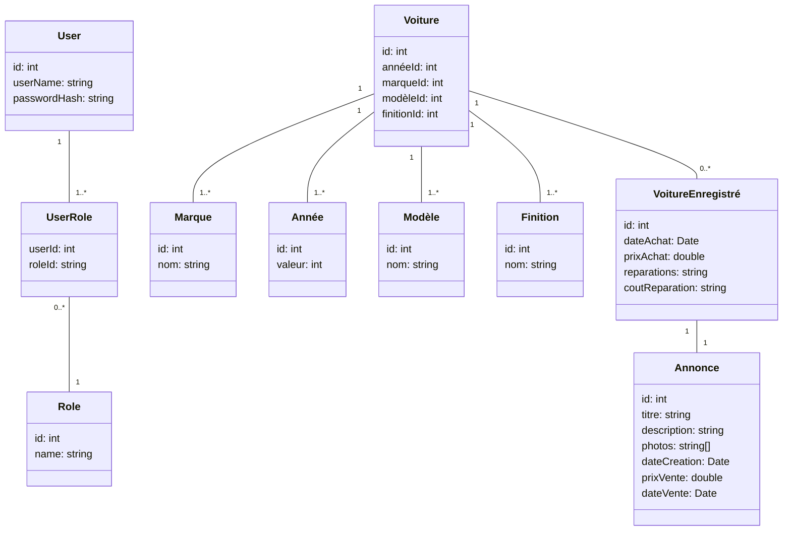

# Express Voitures
> OpenClassrooms Projet 5 : Créez votre première application avec ASP.NET Core


## Informations Générales
Ce projet avait pour objectif de réaliser une application web pour un client fictif, un concessionnaire automobile. Le client souhaitait disposer d'un site lui permettant de répertorier les voitures disponibles à la vente et de les rendre visibles pour ses clients à travers un catalogue de voitures. Pour la réalisation de ce projet, j'ai choisi de développer une API avec ASP.NET Core, qui est consommée par une application Angular.


## Conception
Pour concevoir le modèle de données, j'ai utilisé un diagramme de classes pour représenter les entités et leurs relations. Voici le diagramme de classes :


Vous pouvez également accéder à la maquette du projet réalisée sur Figma en cliquant sur ce lien : [Maquette du projet](https://www.figma.com/file/yRrSWIuO77Ck5AWjuORyeS/Homepage?type=design&node-id=0-1&mode=design).


## Technologies utilisées
- Node.js - 20.12.0
- Angular - 17.3.0
- Angular Material - 17.3.0
- .NET - 8.0
- Entity Framework Core - 8.0.2
- Swashbuckle.AspNetCore - 6.4.0
- Mailjet.Api - 3.0.0
- SQL Express


## Fonctionnalitées
Fonctionnalités disponible pour les visiteurs :
- Accéder au catalogue de voiture
- Contacter le concessionnaire 

Fonctionnalités disponible pour l'administrateur :
- Se connecter
- Créer, modifier, supprimer une voiture
- Créer, modifier, supprimer une annonce


## Prérequis
.NET 8.0 : https://dotnet.microsoft.com/en-us/download/dotnet

.NET Framework 4.7.2 Developper Pack : https://dotnet.microsoft.com/en-us/download/visual-studio-sdks?cid=msbuild-developerpacks

Node : https://nodejs.org/en/download

SQL Express : https://www.microsoft.com/fr-fr/sql-server/sql-server-downloads


> _Veuillez noter qu'une fois l'installation de SQL EXPRESS terminée, vous pouvez récupérer la chaîne de connexion qui sera utilisée par la suite._
> 


## Installation
Une fois les prérequis rempli et le projet téléchargé, vous allez devoir installer Entity Framework Core avec la commande ci-dessous.
```
dotnet tool install dotnet-ef --global
```


Puis entrer cette commande dans le répertoire ExpressVoitures.Server pour créer la base de donnée.
```
dotnet ef database update
```


Ouvrez le fichier appsettings.json et dans la chaine de connexion remplacer la valeur de Data Source part le nom du serveur SQL Express.

Pour ce qui est du service de mail vous devez créer un compte  [Mailjet](). 

Ensuite aller dans l'onglet API pour ensuite créer votre clé api.

Vous pouvez maintenant renseigner votre apiKey et secretKey dans la section MailSettings du fichier appsettings.json.

Pour ce qui est du ReceiverEmail renseigner l'email qui recevra les messages de contact et les demandes de modifications de mot de passe du compte administrateur.


## Usage
Maintenant vous pouvez lancer le projet avec cette commande :
```
dotnet run --launch-profile https
```


Depuis cette adresse [Swagger UI](https://localhost:7182/swagger/index.html) vous avez la documentation de l'api, vous pouvez aussi réaliser des requêtes.

Je vous invite à vous créer un compte adminstrateur depuis la route api/Account/Register. 

**Attention, votre nom d'utilisateur doit obligatoirement être "Admin" pour créer un compte. Vous pouvez créer un seul compte, donc ne perdez pas votre mot de passe.**

Je vous invite à accéder au site en suivant cette adresse : https://localhost:4200/

Si vous souhaitez vous connecter en tant qu'administrateur sur le site, je vous invite à accéder à cette adresse : https://localhost:4200/admin/login


## Etat du projet
Le projet est : _Terminé_ ✅


## Améliorations possibles
- Pouvoir changer l'ordre dans lequel les photos des annonces sont affichées et pouvoir supprimer une photo d'une annonce
- Mettre en place un cache sur notre api
- Mise en place d'une pagination sur le catalogue de voiture, les pages de gestions de voitures et d'annonces
- Ajout de filtre/tri sur le catalogue de voiture, les pages de gestions de voitures et d'annonces
- Avoir la possibilité de générer une description via IA lors de la création d'une annonce
- Permettre au concessionnaire de créer d'autres administrateurs


## Contact
Créer par [@AxekPhanor](https://github.com/AxekPhanor)

Mail : axel.phanor64@gmail.com

